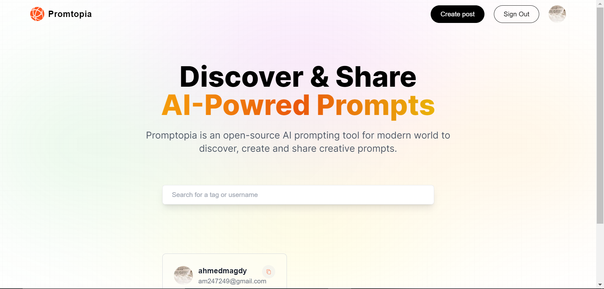
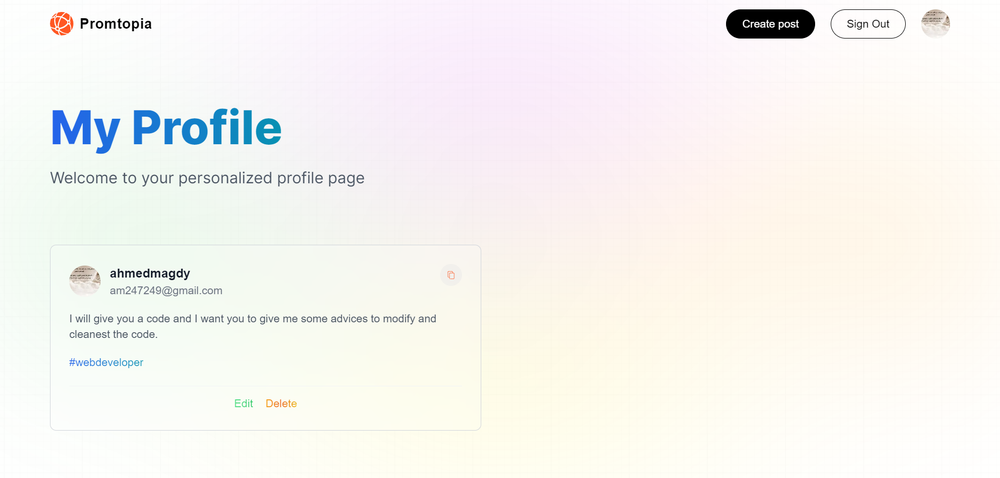

# Promptopia

## What is Promtopia ?

It is an Full-Stack app with NEXT.JS.
It allows you to discover and sharing a different prompts.
You can search about prompts, create prompts , modify prompts even delete prompts but before that you must be registered with google account.
This app is Full-Stack with NEXT JS.

## What did i use to build this application?

I used NEXT.js for building the Front and Back-end, I used MONGODB for database ,and used Tailwind for styling.

## Main Page

Here we can see all Prompts in site Whether you are registered or not.

## Profile Page

If you want to write a post you must be registered of will move you to main page.
If you registered you can see your Prompts, you can modify and delete them

## Links

- Facebook
  https://www.facebook.com/profile.php?id=100085749470017

- X
  https://twitter.com/ahmed_magdy135
